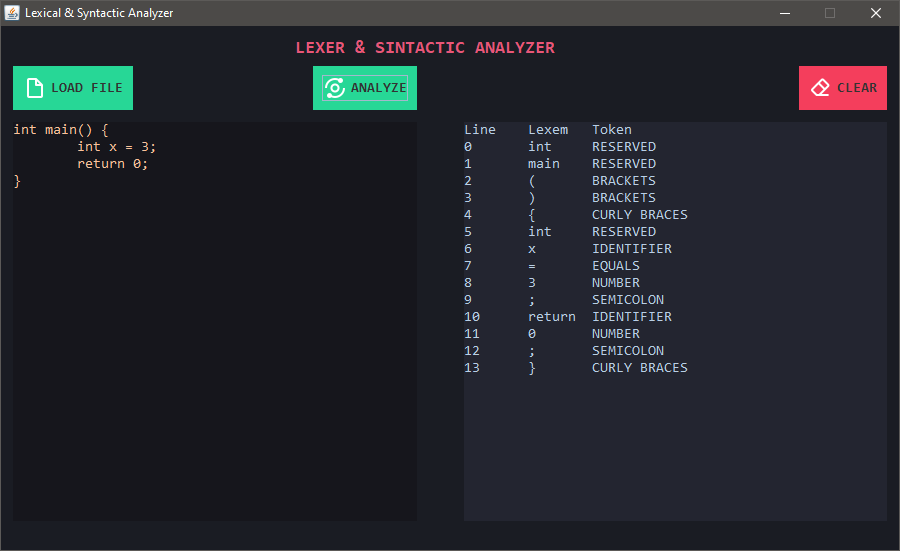

## LEXICAL & SYNTACTIC ANALYZER



## Usage

Before to run the application you must to comment the line `32` of the `main` class
for generate the `LexicalAnalyzer.class`.

```java
27  public static void main(String[] args) {
28    // creates the class from the .flex file
29    LexicalController.generateLexerClass();
30
31    // initialize the app
32    // init();
33   }
```

Once the class is generated you can uncomment the line.
